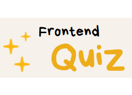

# frontend-quiz

Welcome to frontend quiz! 

If you want to test your knowledge of HTML, CSS and JS this is the place for you!

## Preview of the website 

Click here to see quiz: [Frontend-quiz demo](https://izabelanowak.github.io/frontend-quiz/)

## Description

Tere is a quiz that consists of 10 questions about frontend. 3 questions are about HTML, 3 about CSS and 4 questions about JS. Each question consists of 4 ABCD answers, only one is correct. After answering, the result will be displayed after clicking on the button (Sprawdź odpowiedzi). Additionally, you can use a button that deletes selected answers (Wyczyść odpowiedzi). After checking the answer appears the result and the button,that toggles the highlighting of correct answers(Wyświetl poprawne odpowiedzi).

## How to use
See gif below to see how quiz works!

1. Choose one of the ABCD answers.

2. There is 10 questions

3.Check your answers by clicking on the button or click the button to clear the answers.

4. Click button at the bottom of the page to see correct answers.

## Used technologies:

-   Semantic HTML
-   CSS
-   BEM naming
-   ES6+ features
